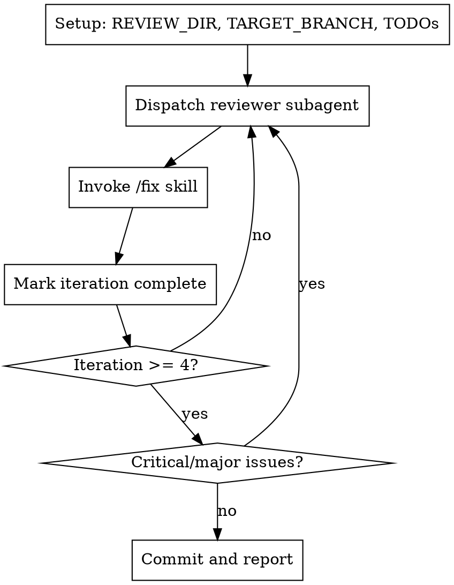

# Review Loop

Orchestrate 4+ review iterations, invoking `/fix` skill after each.

## When to Use

- Before merging feature branches
- After significant code changes
- When thorough automated review is needed
- PR has no blocking review yet

**Not for:** Quick fixes, documentation-only changes, already-reviewed code.

## Process Flow



## Setup

Run the setup script to create session directory and detect target branch:

```bash
eval "$(~/.claude/plugins/cache/onsails-cc/review-loop/*/skills/review-loop/setup.sh)"
```

This sets `$REVIEW_DIR` and `$TARGET_BRANCH` environment variables.

```
TodoWrite([
  {content: "Iteration 1: Review → Fix", status: "in_progress", activeForm: "Running iteration 1"},
  {content: "Iteration 2: Review → Fix", status: "pending", activeForm: "Running iteration 2"},
  {content: "Iteration 3: Review → Fix", status: "pending", activeForm: "Running iteration 3"},
  {content: "Iteration 4: Review → Fix", status: "pending", activeForm: "Running iteration 4"},
])
```

## Each Iteration

**Step 1:** Dispatch reviewer
```
Task(subagent_type: "review-loop:local-reviewer", description: "Iteration N: Review",
     prompt: "OUTPUT FILE: ${REVIEW_DIR}/iterN.md\nTARGET BRANCH: ${TARGET_BRANCH}")
```

**Step 2:** Invoke fix skill
```
Skill(skill: "review-loop:fix", args: "${REVIEW_DIR}/iterN.md")
```

**Step 3:** Mark iteration TODO `completed`, next `in_progress`.

## Completion

```bash
git add -A && git commit -m "fix: address code review issues (N iterations)"
```

Report summary. Do NOT merge.

## Red Flags

- Fix issues yourself → /fix skill does that
- Read/edit code files → subagents do that
- Skip iterations → must run at least 4
- Create fix TODOs → /fix skill does that
