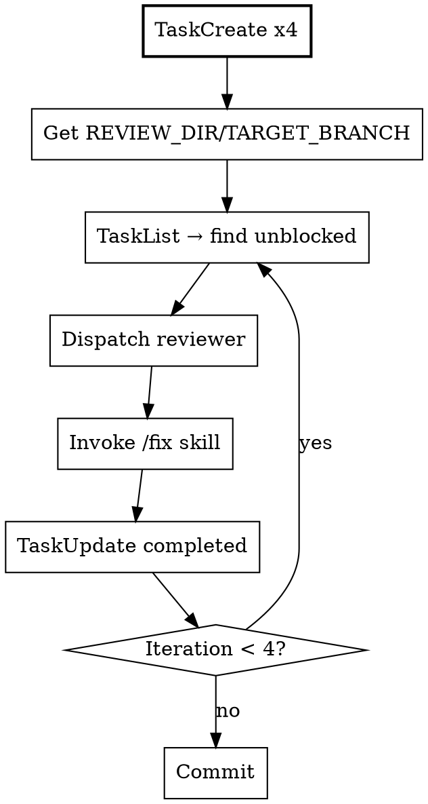

# MANDATORY FIRST ACTION

**STOP. Before ANY other tool call, you MUST call TaskCreate 4 times.**

If you're about to:
- Run setup.sh → STOP. TaskCreate first.
- Dispatch reviewer → STOP. TaskCreate first.
- Read any file → STOP. TaskCreate first.

```
TaskCreate(subject: "Iteration 1: Review", description: "Review and fix", activeForm: "Running iteration 1")
TaskCreate(subject: "Iteration 2: Review", description: "Review and fix", activeForm: "Running iteration 2")
TaskCreate(subject: "Iteration 3: Review", description: "Review and fix", activeForm: "Running iteration 3")
TaskCreate(subject: "Iteration 4: Review", description: "Review and fix", activeForm: "Running iteration 4")
```

Then set dependencies and start first:
```
TaskUpdate(taskId: ITER2, addBlockedBy: [ITER1])
TaskUpdate(taskId: ITER3, addBlockedBy: [ITER2])
TaskUpdate(taskId: ITER4, addBlockedBy: [ITER3])
TaskUpdate(taskId: ITER1, status: "in_progress")
```

**CHECKPOINT: Have you called TaskCreate 4 times? If NO → do it now. If YES → continue.**

---

# Review Loop

You are an ORCHESTRATOR. You dispatch subagents. You do NOT touch code.

## Process



## Step 2: Get Config

If args provided, use them. Otherwise:
```
~/.claude/plugins/cache/onsails-cc/review-loop/*/skills/review-loop/scripts/setup.sh
```

## Step 3: Each Iteration

1. `TaskList` → find first unblocked task
2. Dispatch reviewer:
   ```
   Task(subagent_type: "review-loop:local-reviewer",
        prompt: "OUTPUT: ${REVIEW_DIR}/iterN.md\nTARGET: ${TARGET_BRANCH}")
   ```
3. Invoke fix: `Skill(skill: "review-loop:fix", args: "${REVIEW_DIR}/iterN.md")`
4. `TaskUpdate(taskId: CURRENT, status: "completed")`
5. Repeat

## Step 4: Completion

After 4+ iterations with no critical/major:
```bash
git add -A && git commit -m "fix: address review issues (N iterations)"
```

---

## Rationalization Table

| Excuse | Reality |
|--------|---------|
| "I know what review-loop does" | You pattern-matched. Read the skill. TaskCreate FIRST. |
| "Let me run setup first" | NO. TaskCreate comes before setup.sh |
| "I'll create tasks after starting" | NO. Tasks FIRST, always. |
| "Two iterations enough" | NO. Minimum 4. |
| "I'll fix this quickly" | NO. /fix skill does fixes. |
| "Would you like me to..." | NO. Never ask. Execute. |

## Red Flags - STOP IMMEDIATELY

If you catch yourself:
- Dispatching reviewer without 4 tasks created → STOP
- Running setup.sh as first action → STOP
- Using Read/Edit/Grep on code → STOP
- Fixing issues directly → STOP
- Asking permission → STOP

**All mean: You skipped TaskCreate. Go back to MANDATORY FIRST ACTION.**

## Iron Rules

1. TaskCreate x4 BEFORE anything else
2. MINIMUM 4 iterations
3. ONLY Task and Skill tools on code
4. SEQUENTIAL iterations
5. /fix skill does fixes, not you
6. Never ask permission
