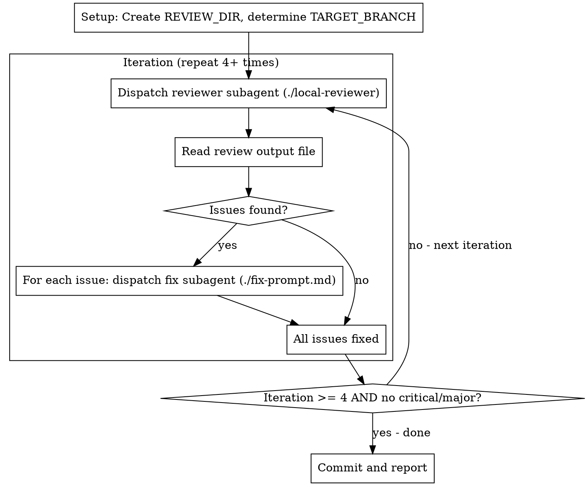

# Review Loop

Automated code review with 4 mandatory iterations. Each iteration: review → fix all issues → repeat.

**Core principle:** Fresh subagent per review + fresh subagent per fix = no context pollution

## Process Flow



## Prompt Templates

- `./fix-prompt.md` - Template for fix subagents (fill in issue details)
- Agent `review-loop:local-reviewer` - Reviewer subagent

## Setup

Create session directory and determine target branch:

```bash
REVIEW_DIR="/tmp/review-loop-$(date +%s)-$$"
mkdir -p "$REVIEW_DIR"

# Target branch (PR base or nearest parent)
TARGET_BRANCH=$(gh pr view --json baseRefName -q .baseRefName 2>/dev/null || \
  git branch -a --contains HEAD^ --no-contains HEAD | head -1 | tr -d ' ')
```

**Initial TODOs - ONLY iteration reviews, NO fix TODOs yet:**
```
TodoWrite([
  {content: "Iteration 1: Review", status: "in_progress", activeForm: "Running iteration 1 review"},
  {content: "Iteration 2: Review", status: "pending", activeForm: "Running iteration 2 review"},
  {content: "Iteration 3: Review", status: "pending", activeForm: "Running iteration 3 review"},
  {content: "Iteration 4: Review", status: "pending", activeForm: "Running iteration 4 review"},
])
```

**Do NOT create "Fix issues" TODOs yet.** Fix TODOs are created in Step 2b AFTER you see the findings.

## Iteration 1

**Step 1: Dispatch reviewer**
```
Task(
  subagent_type: "review-loop:local-reviewer"
  description: "Iteration 1: Review"
  prompt: "OUTPUT FILE: ${REVIEW_DIR}/iter1.md\nTARGET BRANCH: ${TARGET_BRANCH}"
)
```

**Step 2: Read and DISPLAY findings**
```
Read ${REVIEW_DIR}/iter1.md
```

Display ALL issues to user in a summary table:
```
## Iteration N Findings

| # | Severity | File:Line | Issue | Action |
|---|----------|-----------|-------|--------|
| 1 | critical | foo.rs:42 | SQL injection | FIX |
| 2 | major    | bar.rs:15 | Race condition | FIX |
| 3 | minor    | baz.rs:99 | Unused import | SKIP (trivial) |
| 4 | minor    | qux.rs:10 | Missing log | FIX (important) |
| 5 | suggestion | ... | Refactor idea | NOTE |
```

**Triage rules:**
- **Critical/Major**: ALWAYS fix (unless marked FALSE POSITIVE by reviewer)
- **Minor**: Fix if important for current scope, skip if trivial
- **Suggestion**: Note for later, don't fix now
- **FALSE POSITIVE**: Skip (reviewer already validated)

**Step 2b: Create TODOs for dispatching fix subagents**

For each issue marked FIX, create a TODO to dispatch a subagent:

```
TodoWrite([
  {content: "Dispatch subagent: Fix [major] Error swallowed in sidecar watcher", status: "pending", activeForm: "Dispatching fix subagent"},
  {content: "Dispatch subagent: Fix [major] exit(1) instead of error propagation", status: "pending", activeForm: "Dispatching fix subagent"},
  {content: "Dispatch subagent: Fix [minor] channel send result ignored", status: "pending", activeForm: "Dispatching fix subagent"},
  ...
])
```

**Step 3: Execute each "Dispatch subagent" TODO**

For EACH TODO, mark `in_progress` then dispatch the subagent:

```
Task(
  subagent_type: "general-purpose"
  description: "Fix: [SHORT_SUMMARY]"
  prompt: <fill in ./fix-prompt.md template with issue details>
)
```

Mark TODO `completed` only AFTER Task returns.

**You are an orchestrator.** You do NOT fix code yourself. You dispatch subagents to fix.

## Iteration 2

Repeat with `${REVIEW_DIR}/iter2.md`

## Iteration 3

Repeat with `${REVIEW_DIR}/iter3.md`

## Iteration 4

Repeat with `${REVIEW_DIR}/iter4.md`

## Exit Condition

- If iteration >= 4 AND no critical/major issues → proceed to Completion
- Otherwise → continue to next iteration

## Completion

```bash
git add -A && git commit -m "fix: address code review issues (N iterations)"
```

Report summary. Do NOT merge - wait for user.

## Red Flags

**Never:**
- Create "Fix issues" TODOs before seeing review findings (fix TODOs come AFTER Step 2)
- Skip displaying findings (user must see ALL issues before fixes start)
- Skip creating "Dispatch subagent" TODOs (each fix needs a TODO)
- Fix issues yourself (you are orchestrator - ONLY dispatch subagents)
- Read code files to understand issues (subagent does that)
- Edit code files (subagent does that)
- Skip critical/major issues (must dispatch subagent unless FALSE POSITIVE)
- Skip iterations (must run at least 4)
- Dispatch multiple fix subagents in parallel (sequential only)
- Proceed to next iteration with unfixed critical/major issues
