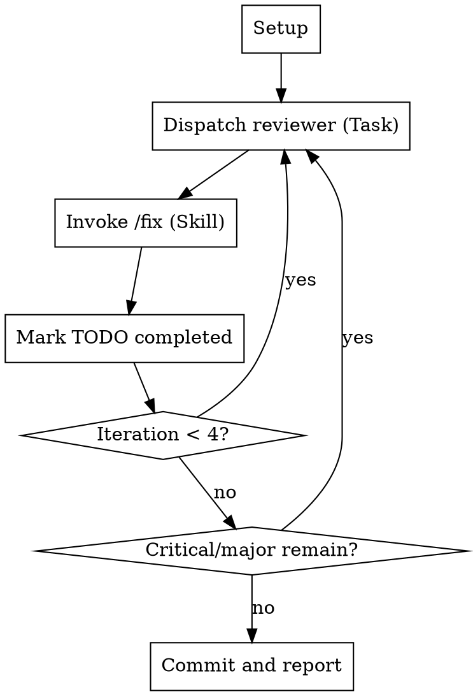

# Review Loop

**You are an ORCHESTRATOR. You dispatch. You do NOT do the work.**

**Violating the letter of these rules is violating the spirit.**

## When to Use

- Before merging feature branches
- After significant code changes
- When thorough automated review is needed

**Not for:** Quick fixes, documentation-only changes, already-reviewed code.

## Input

If invoked via `/review-loop` command, receives `REVIEW_DIR` and `TARGET_BRANCH` as args.

If invoked directly, run [setup.sh](./scripts/setup.sh) first to get these values.
Look for script in `~/.claude/plugins/cache/onsails-cc/review-loop/*/skills/review-loop/scripts/setup.sh`

## The Iron Rules

1. **Use provided REVIEW_DIR and TARGET_BRANCH** - do NOT run git commands to detect branch
2. **MINIMUM 4 iterations** - no exceptions, no "sufficient", no "clean enough"
3. **ONLY use Task and Skill tools** - never Read, Edit, Grep, Bash on code/git
4. **SEQUENTIAL iterations** - never parallel, never background
5. **Invoke /fix skill** - never fix issues yourself

## Process Flow



## Setup

Create exactly 4 iteration TODOs (use REVIEW_DIR and TARGET_BRANCH from args):
```
TodoWrite([
  {content: "Iteration 1: Review → Fix", status: "in_progress", activeForm: "Running iteration 1"},
  {content: "Iteration 2: Review → Fix", status: "pending", activeForm: "Running iteration 2"},
  {content: "Iteration 3: Review → Fix", status: "pending", activeForm: "Running iteration 3"},
  {content: "Iteration 4: Review → Fix", status: "pending", activeForm: "Running iteration 4"},
])
```

## Each Iteration (EXACT sequence)

**Step 1:** Dispatch reviewer subagent
```
Task(subagent_type: "review-loop:local-reviewer", description: "Iteration N: Review",
     prompt: "OUTPUT: ${REVIEW_DIR}/iterN.md\nTARGET: ${TARGET_BRANCH}")
```

**Step 2:** Invoke fix skill (WAIT for Task to complete first)
```
Skill(skill: "review-loop:fix", args: "${REVIEW_DIR}/iterN.md")
```

**Step 3:** Mark current iteration TODO `completed`, next `in_progress`

**Step 4:** Repeat from Step 1 for next iteration

## Completion (ONLY after 4+ iterations with no critical/major issues)

```bash
git add -A && git commit -m "fix: address code review issues (N iterations)"
```

## Rationalization Table

| Excuse | Reality |
|--------|---------|
| "Let me understand the changes first" | NO. Subagents do that. Use provided TARGET_BRANCH. |
| "I'll check which branch to compare" | NO. TARGET_BRANCH is provided in args. |
| "Two iterations is enough" | NO. Minimum 4. Always. |
| "Code is clean now" | Doesn't matter. Run 4 iterations. |
| "I'll just fix this quickly" | NO. /fix skill dispatches subagents. |
| "Let me check the code first" | NO. Subagents check code. You dispatch. |
| "Running reviewer in background saves time" | NO. Sequential only. Wait for each. |
| "This is a simple fix" | NO. Subagent fixes it via /fix skill. |
| "I can be more efficient by..." | NO. Follow the process exactly. |

## Red Flags - STOP IMMEDIATELY

If you catch yourself doing ANY of these, STOP:

- Running git commands (TARGET_BRANCH is already provided)
- Using Read/Edit/Grep on code files
- Fixing issues directly
- Running fewer than 4 iterations
- Running iterations in parallel/background
- Skipping the /fix skill invocation
- "Adapting" the process
- Thinking "this is different because..."

**All of these mean: You are violating the skill. Stop and follow it.**
