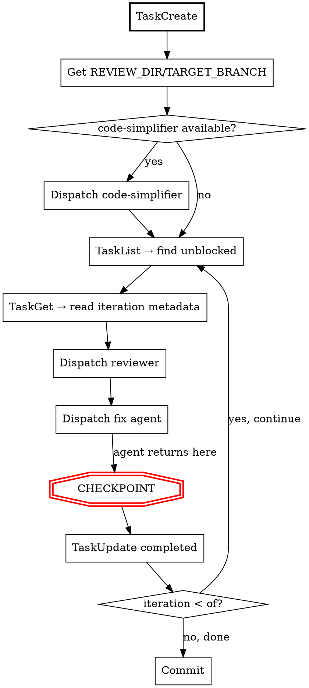

# MANDATORY FIRST ACTION

**STOP. Before ANY other tool call, you MUST call TaskCreate.**

If you're about to:
- Run setup.sh → STOP. TaskCreate first.
- Dispatch reviewer → STOP. TaskCreate first.
- Read any file → STOP. TaskCreate first.

## Step 1: Create Tasks

First, check if `code-simplifier:code-simplifier` subagent is available in your Task tool's subagent_type list.

**If code-simplifier IS available:**
```
TaskCreate(subject: "Simplify code", description: "Run code-simplifier before review", activeForm: "Simplifying code")
TaskCreate(subject: "Iteration 1: Review", description: "Review and fix", activeForm: "Running iteration 1", metadata: {"iteration": 1, "of": 4})
TaskCreate(subject: "Iteration 2: Review", description: "Review and fix", activeForm: "Running iteration 2", metadata: {"iteration": 2, "of": 4})
TaskCreate(subject: "Iteration 3: Review", description: "Review and fix", activeForm: "Running iteration 3", metadata: {"iteration": 3, "of": 4})
TaskCreate(subject: "Iteration 4: Review", description: "Review and fix", activeForm: "Running iteration 4", metadata: {"iteration": 4, "of": 4})
```

Then set dependencies (ITER1 blocked by SIMPLIFY):
```
TaskUpdate(taskId: ITER1, addBlockedBy: [SIMPLIFY])
TaskUpdate(taskId: ITER2, addBlockedBy: [ITER1])
TaskUpdate(taskId: ITER3, addBlockedBy: [ITER2])
TaskUpdate(taskId: ITER4, addBlockedBy: [ITER3])
TaskUpdate(taskId: SIMPLIFY, status: "in_progress")
```

**If code-simplifier is NOT available:**
```
TaskCreate(subject: "Iteration 1: Review", description: "Review and fix", activeForm: "Running iteration 1", metadata: {"iteration": 1, "of": 4})
TaskCreate(subject: "Iteration 2: Review", description: "Review and fix", activeForm: "Running iteration 2", metadata: {"iteration": 2, "of": 4})
TaskCreate(subject: "Iteration 3: Review", description: "Review and fix", activeForm: "Running iteration 3", metadata: {"iteration": 3, "of": 4})
TaskCreate(subject: "Iteration 4: Review", description: "Review and fix", activeForm: "Running iteration 4", metadata: {"iteration": 4, "of": 4})
```

Then set dependencies and start:
```
TaskUpdate(taskId: ITER2, addBlockedBy: [ITER1])
TaskUpdate(taskId: ITER3, addBlockedBy: [ITER2])
TaskUpdate(taskId: ITER4, addBlockedBy: [ITER3])
TaskUpdate(taskId: ITER1, status: "in_progress")
```

**Report to user:** "code-simplifier plugin not installed. Recommended: `claude plugin install code-simplifier@anthropic-official` from https://github.com/anthropics/claude-plugins-official"

**CHECKPOINT: Have you created tasks? If NO → do it now. If YES → continue.**

---

# Review Loop

You are an ORCHESTRATOR. You dispatch subagents. You do NOT touch code.

## Process



## Step 2: Get Config

If args provided, use them. Otherwise:
```
~/.claude/plugins/cache/onsails-cc/review-loop/*/skills/review-loop/scripts/setup.sh
```

## Step 2.5: Code Simplification (if available)

If `code-simplifier:code-simplifier` subagent is available, dispatch it to simplify code changes between current branch and TARGET_BRANCH:
```
Task(subagent_type: "code-simplifier:code-simplifier",
     prompt: "Simplify code changes between HEAD and ${TARGET_BRANCH}. Focus only on files modified in this branch.")
TaskUpdate(taskId: SIMPLIFY, status: "completed")
```

## Step 3: Each Iteration

1. `TaskList` → find first unblocked iteration task
2. `TaskGet(taskId: CURRENT)` → read metadata.iteration and metadata.of
3. `TaskUpdate(taskId: CURRENT, status: "in_progress")`
4. Dispatch reviewer:
   ```
   Task(subagent_type: "review-loop:local-reviewer",
        prompt: "OUTPUT: ${REVIEW_DIR}/iterN.md\nTARGET: ${TARGET_BRANCH}")
   ```
   **Reviewer returns a summary.** Display it to user - this shows what will be fixed.
5. Dispatch fix agent:
   ```
   Task(subagent_type: "review-loop:fix",
        prompt: "REVIEW_FILE: ${REVIEW_DIR}/iterN.md\nNEXT_ITER_TASK_ID: ${next_iter_task_id}")
   ```
6. `TaskUpdate(taskId: CURRENT, status: "completed")`

### CHECKPOINT (after fix agent returns)

**STOP HERE. The fix agent has returned. You MUST now check iteration progress:**

```
Current iteration: ${metadata.iteration}
Total iterations: ${metadata.of}

Is ${metadata.iteration} < ${metadata.of}?
  YES → Go to Step 3.1 (TaskList → find next unblocked)
  NO  → Go to Step 4 (Completion)
```

**DO NOT STOP after fix agent returns.** The fix agent is a sub-step, not the end of the loop.

**WHY 4+ iterations are mandatory:**
- Reviewers find different issues on different passes
- Fixes may introduce new problems
- Context builds across iterations
- First pass often misses subtle issues

**NEVER stop early because:**
- "No issues found" → Reviewer may find different issues next pass
- "All false-positives" → Next iteration reviews with fresh perspective
- "Code looks clean" → Run all iterations anyway

## Step 4: Completion

After 4+ iterations with no critical/major:

1. **Mark final iteration task completed:**
   ```
   TaskUpdate(taskId: ITER4, status: "completed")
   ```

2. **Verify all tasks completed:**
   ```
   TaskList  → All iteration tasks should show "completed"
   ```

3. **Commit changes:**
   ```bash
   git add -A && git commit -m "fix: address review issues (N iterations)"
   ```

**Do NOT leave tasks in pending/in_progress state.**

---

## Rationalization Table

| Excuse | Reality |
|--------|---------|
| "I know what review-loop does" | You pattern-matched. Read the skill. TaskCreate FIRST. |
| "Let me run setup first" | NO. TaskCreate comes before setup.sh |
| "I'll create tasks after starting" | NO. Tasks FIRST, always. |
| "Two iterations enough" | NO. Minimum 4. |
| "I'll fix this quickly" | NO. Fix agent does fixes. |
| "Would you like me to..." | NO. Never ask. Execute. |
| "Skip code-simplifier, it's optional" | Check availability first. If available, run it. |
| "No issues found, stopping early" | NO. Reviewers find different issues each pass. Run all 4. |
| "All were false-positives, done" | NO. Next iteration may find real issues. Continue. |
| "Code is clean after iteration 1" | NO. Run all 4 iterations. First pass misses subtle issues. |
| "Fix agent returned, I'm done" | NO. Fix agent is a sub-step. Go to CHECKPOINT, check iteration count. |
| "Fix summary looks complete" | NO. Summary is the agent's output. You're still in Step 3 of review-loop. |

## Red Flags - STOP IMMEDIATELY

If you catch yourself:
- Dispatching reviewer without tasks created → STOP
- Running setup.sh as first action → STOP
- Using Read/Edit/Grep on code → STOP
- Fixing issues directly → STOP
- Asking permission → STOP
- Skipping code-simplifier without checking availability → STOP
- Stopping before iteration 4 because "no issues" → STOP
- Skipping iterations because "all false-positives" → STOP
- **Ending response after fix agent returns** → STOP (go to CHECKPOINT)
- **Not checking metadata.iteration after fix agent** → STOP (read the task, check the count)

**All mean: You violated the skill. Go back and follow it exactly.**

## Iron Rules

1. TaskCreate BEFORE anything else
2. Check code-simplifier availability, run if present
3. MINIMUM 4 review iterations
4. ONLY Task tool on code (dispatch subagents)
5. SEQUENTIAL iterations
6. Fix agent does fixes, not you
7. Never ask permission
